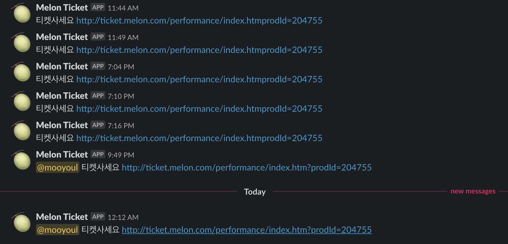
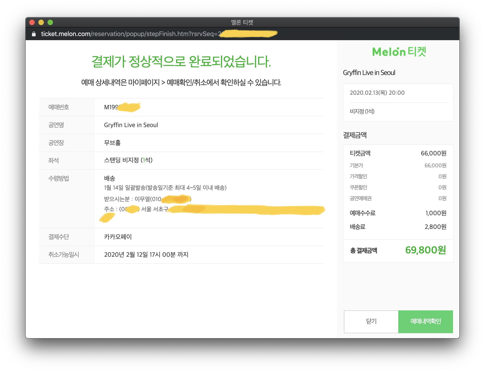

# melon-ticket-actions

[](https://github.com/mooyoul/melon-ticket-actions/actions)
[](https://github.com/semantic-release/semantic-release)
[](https://renovatebot.com/)
[](http://mooyoul.mit-license.org/)

GitHub action that checks ticket availability in Melon Ticket (Korean online ticket store) website.

~~암표상들 다 망해라~~ 그리핀 내한공연 보게 해주세요 🙏

-----



### ⭐️ 존버는 승리한다 ⭐️



## Usage

Please see [example workflow](https://github.com/mooyoul/melon-ticket-actions/blob/1c5a56b9cdd594051d856c16b020f0c5835f6955/.github/workflows/example.yml), or [Workflow Log](https://github.com/mooyoul/melon-ticket-actions/actions?query=workflow%3Aexample)

## Secrets

This action sends notifications to Slack. Create a repository secret named `SLACK_WEBHOOK_URL`: Settings → Secrets and variables → Actions → New repository secret. Put your Slack incoming webhook URL there and the workflow will read it as `${{ secrets.SLACK_WEBHOOK_URL }}`.

## Sample Github Actions Configuration 

```yaml
name: example
on:
  schedule:
    - cron: '*/5 * * * *' # Every 5 minutes
jobs:
  job:
    runs-on: ubuntu-latest
    timeout-minutes: 5
    steps:
      - name: Check Tickets
        uses: mooyoul/melon-ticket-actions@v1.1.0
        with:
          product-id: 204755
          schedule-id: 100001
          seat-id: 1_0
          slack-incoming-webhook-url: ${{ secrets.SLACK_WEBHOOK_URL }}
          message: '<@U12345678> 달려달려~'
```

## License

[MIT](LICENSE)

See full license on [mooyoul.mit-license.org](http://mooyoul.mit-license.org/)
